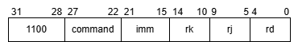
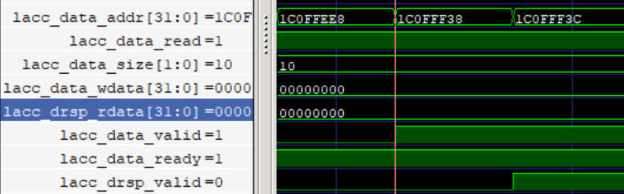
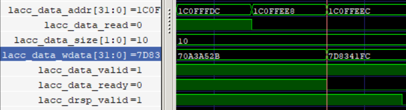

# LaCC 接口

LaCC(Loongarch32R Custom Coprocessor Interface) 接口是 Open-LA500 用于扩展自定义指令的接口。

# 指令格式



| 域     | 描述                                                |
| ------ | --------------------------------------------------- |
| opcode | 固定为1100,用于确定当前指令                       |
| command| 用于编码多个自定义指令，将发送至lacc接口            |
| imm    | 额外的立即数                                        |
| rj     | 第一个寄存器的编码                                  |
| rk     | 第二个寄存器的编码                                  |
| rd     | 目的寄存器编码，当目的寄存器不为0时会写回寄存器堆中 |

# 接口定义

> 方向为协处理器视角

| 通道     | 方向   | 宽度          | 信号名          | 描述                                                         |
| -------- | ------ | ------------- | --------------- | ------------------------------------------------------------ |
| 全局     | input  | 1             | lacc_flush      | 当处理器触发异常或分支预测失败时将该信号置位                 |
| 请求     | input  | 1             | lacc_req_valid  | 处理器核发送请求                                             |
| 请求     | input  | LACC_OP_WIDTH | lacc_req_command| 指令中的command域                                           |
| 请求     | input  | 7             | lacc_req_imm    | 指令中的imm域                                                |
| 请求     | input  | 32            | lacc_req_rj     | 第一个寄存器的值                                             |
| 请求     | input  | 32            | lacc_req_rk     | 第二个寄存器的值                                             |
| 回复     | output | 1             | lacc_rsp_valid  | 指令完成信号，处理器将继续执行                               |
| 回复     | output | 32            | lacc_rsp_rdat   | 写回寄存器的数据                                             |
| 访存请求 | output | 1             | lacc_data_valid | 向dcache发送的访存请求信号                                   |
| 访存请求 | input  | 1             | lacc_data_ready | dcache当前是否可以接受请求                                   |
| 访存请求 | output | 32            | lacc_data_addr  | 访存地址                                                     |
| 访存请求 | output | 1             | lacc_data_read  | 是否为读请求                                                 |
| 访存请求 | output | 32            | lacc_data_wdata | 写入数据                                                     |
| 访存请求 | output | 2             | lacc_data_size  | 访存数据大小 <br>2'b00: byte<br>2'b01: half<br>2'b10: word   |
| 访存回复 | input  | 1             | lacc_drsp_valid | dcache发送的回复信号<br>写请求将会在第二周期接收到该回复<br>读请求将会在dcache成功后接收 |
| 访存回复 | input  | 32            | lacc_drsp_data  | 访存得到的数据                                               |

# 运行流程

1. 在解码阶段解析 lacc 指令，并将 op 和 imm 发送给执行阶段
2. 在执行阶段`lacc_req_valid`为1，lacc接口将接受 lacc 指令并暂停，直到`lacc_rsp_valid`为高才会将指令发送给下一级
3. 如果需要访存，可以将 `lacc_data_valid` 置高并设置访存地址及大小等信息。当`lacc_data_valid`和`lacc_data_ready`同时为高则当前请求成功发送至dcache。
4. 当指令执行完成之后将`lacc_rsp_valid`置高，指令将从 exe 级继续执行


lacc读请求时序,读取地址为0x1C0FFF38，读取数据为0x00000000



lacc写请求时序，写入地址为0x1C0FFEE8,写入数据为0x70A3A52B



# 自定义指令

添加自定义指令只需两步：

1. 修改`mycpu.h`中的`LACC_OP_SIZE`为自定义指令数量（若`LACC_OP_SIZE`为1需要修改`LACC_OP_WIDTH`为1），并且取消`HAS_LACC`的注释
2. 在`lacc_core.v`中删除示例`lacc_demo`，写入自定指令代码

# demo

demo实现了从两个地址载入向量，点乘之后再存入缓存中的功能，代码位于`lacc_demo.v`中。

## 指令

| 指令     | op   | rj    | rk    | 描述                                            |
| -------- | ---- | ----- | ----- | ----------------------------------------------- |
| op_cfg   | 1    | size  | waddr | 设置写回地址及向量长度                          |
| op_lmadd | 0    | addr1 | addr2 | 设置需要计算的两个内存地址，对位相加再存入waddr |

## 状态机

| 状态      | 说明            | 转换条件                                  | 下一状态  |
| --------- | --------------- | ----------------------------------------- | --------- |
| IDLE      |                 | lacc_req_valid & op_lmadd                 | REQ_ADDR1 |
| REQ_ADDR1 | 访问addr1的数据 | data_hsk(访问addr1数据)                   | REQ_ADDR2 |
| REQ_ADDR2 | 访问addr2的数据 | data_hsk(访问addr2数据)                   | FINAL     |
| FINAL     | 计算结果并写回  | data_hsk & req_size_nz(写入数据且size!=0) | REQ_ADDR1 |
| FINAL     |                 | data_hsk & ~req_size_nz                   | IDLE      |

data_hsk即`lacc_data_valid & lacc_data_ready`，表明当前访存请求发送成功。

**数据控制**

使用buffer_valid信号表示第一个地址的数据是否被接收。wdata_valid表示写回数据准备完成

当`buffer_valid & lacc_drsp_valid`为高时说明第二个地址的数据已经返回，在该周期计算`buffer_data+lacc_drsp_rdata`并写入wdata

# 修改编译器

我们可以使用".word xxxxxxx"的格式在汇编中添加自定义指令。但是这种方式阅读不够友好，并且不利于操作数读写，例如

```c
	asm volatile (
		"move $r5, %[addr]\n\t"
		"move $r6, %[para]\n\t"
		".word 0xc00018a0\n\t"
		::[addr]"r"(addr),[para]"r"(para)
		:"$r5", "$r6"
	);
```

**修改编译器**

我们可以修改binutils使得编译器可以识别自定义指令。

- 下载loongarch toolchain: https://gitee.com/loongson-edu/la32r-toolchains/tree/master
- 进入src/la32r_binutils/opcodes,打开loongarch-opc.c,在`loongarch_fix_opcodes`结构体中添加
```c
{0xc0000000, 0xf0000000, "lacc", "u22:6,r0:5,r5:5,r10:5,u15:7", 0, 0, 0, 0}
```
- 根据toolchina的README编译，并将bin目录添加到path中


自定义指令的格式为:

```
lacc command, rd, rj, rk, imm
```

上例可以修改为：

```c
	asm volatile (
		"lacc 0x0, $r0, %[addr], %[para], 0x0\n\t"
		::[addr]"r"(addr), [para]"r"(para)
	);
```

